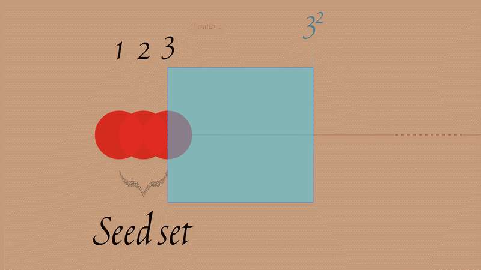

# Prime Partition Algorithm

[](LICENSE)
[](https://zenodo.org/records/20727496)
[](#implementations)

**Grow prime numbers instead of sieving for them.**

Every prime generator you've used works by elimination: list a range of integers, cross out the composites, keep what's left. The Prime Partition Algorithm flips that around. Starting from a tiny seed set like `{1, 2}`, it *constructs* new primes algebraically — partitioning the set, exponentiating and multiplying within each half, then combining the results — and lets the set of known primes grow itself, iteration by iteration.

No sieve. No trial range. Just a seed and a few algebraic operations.



## Overview

Prime generation algorithms typically fall into two categories: sieving methods (e.g. the classic [Sieve of Eratosthenes](https://en.wikipedia.org/wiki/Sieve_of_Eratosthenes)) that systematically eliminate composites, and primality testing of structured sequences. This project introduces a third, lateral approach: **partition-based constructive generation** through algebraic operations on binary set partitions.

This was originally published [here](https://github.com/EtherBit/A-Most-Curious-Algorithm) and [here](https://github.com/EtherBit/On-Immeasurable-Magnitudes). A formal preprint, *"A Useless Recipe for Primes,"* is available on [Zenodo](https://zenodo.org/records/20727496) and in this repo under [`publication/`](publication).

## The Algorithm in a Nutshell

Starting with a seed set (e.g., `{1, 2}`):

1. **Partition** the set into two groups (all possible ways)
2. **Exponentiate** elements (raise to powers 1–E)
3. **Multiply** within each group to get two products
4. **Combine** via sum and absolute difference
5. **Filter** for primes in the range `(max, max²)`
6. **Grow** the seed set with newly discovered primes
7. **Repeat** for multiple iterations

Each iteration reaches further into the number line — new primes born from the arithmetic of the ones before them.

## Quick Start

No dependencies required — grab the Python version and run it:

```bash
git clone git@github.com:microgeant/PrimePartitionAlgorithm.git
cd PrimePartitionAlgorithm/python
python3 prime_partition.py
```

```
=== PYTHON VERSION ===
Hello primes: [3, 5, 7, 11, 13, 17, 19, 23, 29, 31, ...]
Total discovered: 64
Found composites: []
```

## Implementations

The same algorithm, faithfully reimplemented across nine languages — pick the one you're comfortable reading, or compare a few to see how the idea translates across paradigms.

| Language | Source | Notes |
|----------|--------|-------|
| [Python](python) | [`prime_partition.py`](python/prime_partition.py) | Reference implementation, easiest to read |
| [Rust](rust) | [`prime_partition.rs`](rust/prime_partition.rs) | |
| [C](c) | [`prime_partition.c`](c/prime_partition.c) | Includes a `Makefile` |
| [Kotlin](kotlin) | [`PrimePartition.kt`](kotlin/PrimePartition.kt) | |
| [Haskell](haskell) | [`PrimePartition.hs`](haskell/PrimePartition.hs) | |
| [Julia](julia) | [`prime_partition.jl`](julia/prime_partition.jl) | |
| [Scheme](scheme) | [`prime-partition.scm`](scheme/prime-partition.scm) | |
| [Zig](zig) | [`prime_partition.zig`](zig/prime_partition.zig) | Includes a `build.zig` |
| [Jai](jai) | [`prime_partition.jai`](jai/prime_partition.jai) | |

Each directory has its own `README.md` with prerequisites and exact run instructions.

## Repository Layout

```
PrimePartitionAlgorithm/
├── python/, rust/, c/, kotlin/, haskell/, julia/, scheme/, zig/, jai/
│   └── implementation + language-specific README
├── publication/
│   ├── A Useless Recipe for Primes.pdf   # the preprint
│   ├── demo/                             # demo gif + number line visualization
│   ├── prime_synthesis.py
│   └── PrimeSynthesis.kt
└── LICENSE
```

## Next Steps

- [x] Add Kotlin Implementation
- [x] Add Python Implementation
- [x] Add C Implementation
- [x] Add Haskell Implementation
- [x] Add Scheme Implementation
- [x] Add Rust Implementation
- [x] Add Julia Implementation
- [x] Add Zig Implementation
- [x] Add Jai Implementation
- [x] Add Explanation (preprint paper)

## Citing

If you use this work, please cite the Zenodo preprint: https://zenodo.org/records/20727496

## License

[MIT](LICENSE)
